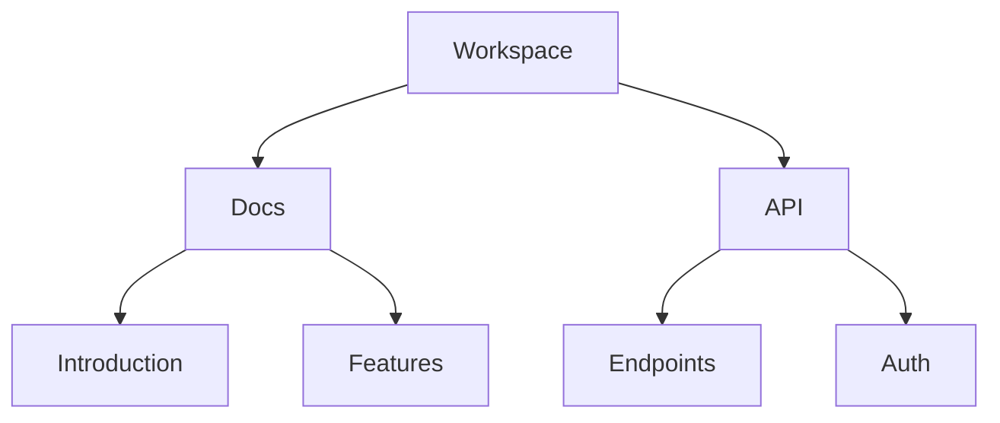

## Overview

Quietmood provides powerful tools to create, organize, and share your project documentation efficiently. You can build structured knowledge bases with intuitive editing, flexible organization, robust search, and versatile export options. These core features enable you to maintain high-quality docs without complexity.

<Callout kind="tip">
Start with a new document to experience these features hands-on. Use the rich text editor for quick setup.
</Callout>

## Key Features

Discover the essential capabilities through these highlighted features.

<Columns cols={2}>
  <Card title="Document Creation" icon="edit-3" href="#document-creation">
    Create and edit docs with real-time collaboration and markdown support.
  </Card>
  <Card title="Organization" icon="folder" href="#organization">
    Build folder structures for scalable content management.
  </Card>
  <Card title="Search" icon="search" href="#search">
    Find content instantly with advanced filtering.
  </Card>
  <Card title="Export" icon="download" href="#export">
    Share docs via PDF, HTML, or public links.
  </Card>
</Columns>

## Document Creation and Editing

Create new documents from the dashboard or within folders. The editor supports markdown, rich text, and embeds.

<Steps>
  <Step title="Create Document" icon="plus">
    Click the `+ New Document` button.
    
    Select template or blank page.
  </Step>
  <Step title="Edit Content">
````markdown
# Welcome to Quietmood

## Quick Start

- Install via npm
- Configure your workspace
- Start editing
````
  </Step>
  <Step title="Publish" icon="upload">
    Save and publish to make live.
  </Step>
</Steps>

Use version history to track changes and revert if needed.

## Folder Structures and Organization

Organize docs hierarchically for better navigation.



Drag and drop to reorder. Nested folders support unlimited depth.

<Callout kind="info">
Limit nesting to 3 levels for optimal performance.
</Callout>

## Search and Filtering Capabilities

Quietmood's search indexes all content instantly.

| Feature | Description | Filters Available |
|---------|-------------|-------------------|
| Full-text Search | Matches titles, body, tags | Exact, fuzzy, regex |
| Tag Filtering | Filter by custom tags | Multiple tags |
| Advanced Filters | Date, author, status | Date range, status |

Enter queries like `api auth` to find relevant pages.

<Tabs>
  <Tab title="Basic Search" icon="search">
    Type keywords in the top bar.
  </Tab>
  <Tab title="Advanced" icon="filter">
    Use `tag:api status:draft` for precise results.
  </Tab>
</Tabs>

## Export and Sharing Options

Export docs for offline use or sharing.

<CodeGroup tabs="PDF,HTML,Markdown">
````bash
# PDF Export
quietmood export --format=pdf --path=/docs/intro
````

````html
<!-- HTML Bundle -->
<!DOCTYPE html>
<html>
<head><title>Quietmood Docs</title></head>
<body><!-- Content --></body>
</html>
````

````markdown
# Exported Doc
Content from Quietmood.
````
</CodeGroup>

Generate public links or embed codes for seamless sharing.

<Expandable title="Advanced Export Options" default-open="false">
Configure custom themes and watermarks via settings.
</Expandable>

## Best Practices

- Use consistent naming for folders.
- Tag docs for better discoverability.
- Regularly export backups.

<Columns cols={3}>
  <Card title="Quickstart" icon="zap" href="/quickstart">
    Get started fast.
  </Card>
  <Card title="Authentication" icon="shield" href="/authentication">
    Secure your workspace.
  </Card>
  <Card title="Changelog" icon="git-branch" href="/changelog">
    Stay updated.
  </Card>
</Columns>